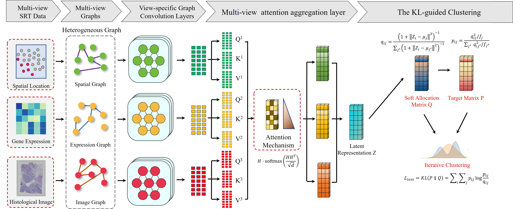

# Landviewer
# Landviewer: characterization of tissue landscapes with multi-view graph learning from spatially resolved transcriptomics

## Overview
The rapid development of spatially resolved transcriptomics (SRT) technologies has provided novel insights for elucidating the spatial architecture of tissue. However, many methods neglecting complementary information among different modalities within SRT datasets, thus limiting the accuracy of spatial domain identification. To address this issue, we propose Landviewer, an end-to-end multi-view graph learning method for spatial domain identification. Landviewer constructs adjacency relationships across gene expression, spatial locations, and histological images, and employs graph convolutional encoders combined with an attention mechanism to achieve automatic fusion of multimodal information. We additionally introduce a self-supervised Kullback-Leibler divergence to enhance the robustness of the Landviewer. This strategy strengthens the influence of high-confidence samples, thereby improving clustering accuracy and stability. Experimental evaluations on multi-platform datasets, including 10x Visium, MERFISH, and BaristaSeq, demonstrate that Landviewer can not only identify functional domains across various tissues, but also decipher region-associated molecular pathways and complex cell-cell interactions.



## Requirements and Installation
[](https://pypi.org/project/anndata/) [](https://pypi.org/project/pandas/) [](https://pypi.org/project/numpy/1.22.0/) [](https://pypi.org/project/scanpy/) [](https://github.com/scikit-learn/scikit-learn/)  [](https://pytorch.org/get-started/locally/) [](https://pypi.org/project/matplotlib/) [](https://pypi.org/project/scipy/1.9.1/) 

### Create and activate Python environment
It is recommended to use a Python version  `3.9`. We recommend using Anaconda, and then you can create a new environment.
```
conda create -n Landviewer python=3.9
conda activate Landviewer
```

### Install PyTorch
We developed Landviewer in a CUDA 11.8 environment.
```
pip install torch==2.1.0+cu118 --extra-index-url https://download.pytorch.org/whl/cu118
```

```
### Install Landviewer
```
git clone https://github.com/zhangdaoliang/Landviewer.git

cd Landviewer

python setup.py build

python setup.py install --user
```

## Datasets
All datasets used in this paper are publicly available.

(1) 10x Visium human breast cancer data (https://support.10xgenomics.com/spatial-gene-expression/datasets/1.1.0/V1_Breast_Cancer_Block_A_Section_1); 

(2) 10x Visium mouse brain tissue (https://www.10xgenomics.com/resources/datasets); 

(3) MERFISH mouse hypothalamus dataset (https://datadryad.org/stash/dataset/doi:10.5061/dryad.8t8s248); 

(4) BaristaSeq mouse primary visual area (https://spacetx.github.io/data.html); 

(5) STARmap mouse medial prefrontal cortex (https://www.starmapresources.com/data).
